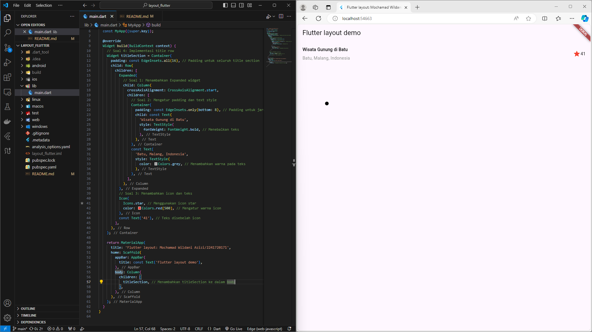

# layout_flutter / Jobsheet 6

## Praktikum 1
* Main Function & MyApp Class:
  * Fungsi main() menjalankan aplikasi dengan widget MyApp.
  * MyApp adalah widget utama yang bersifat stateless (tidak berubah), dan menggunakan MaterialApp untuk membungkus antarmuka aplikasi.
* Title Section:
  * titleSection adalah widget yang dibuat menggunakan Container, berisi baris (Row) yang memiliki dua bagian:
    * Kolom Kiri (Expanded): Berisi teks "Wisata Gunung di Batu" dan "Batu, Malang, Indonesia". Judulnya dicetak tebal, sedangkan teks lokasinya berwarna abu-abu.
    * Kolom Kanan: Berisi ikon bintang berwarna merah dan angka "41", merepresentasikan jumlah rating atau nilai.
* Tampilan Utama:
  * Di dalam metode build(), terdapat Scaffold yang menyediakan struktur dasar dengan sebuah AppBar (judul aplikasi) dan sebuah kolom di body yang memuat title section.

