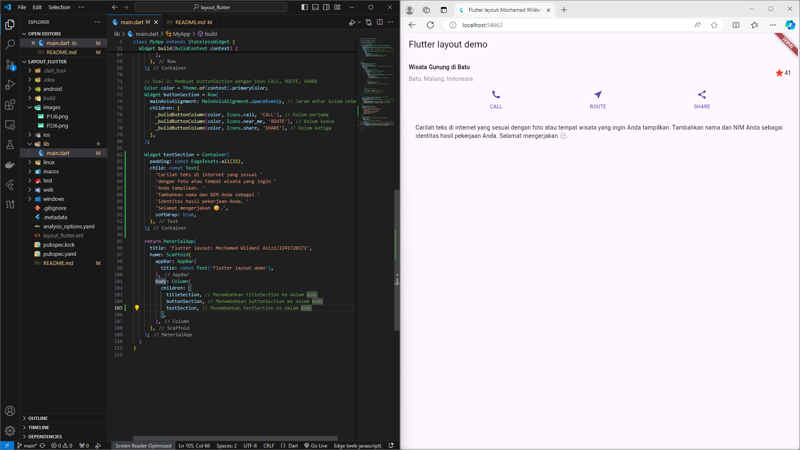

# layout_flutter / Jobsheet 6

## Praktikum 1
* Main Function & MyApp Class:
  * Fungsi main() menjalankan aplikasi dengan widget MyApp.
  * MyApp adalah widget utama yang bersifat stateless (tidak berubah), dan menggunakan MaterialApp untuk membungkus antarmuka aplikasi.
* Title Section:
  * titleSection adalah widget yang dibuat menggunakan Container, berisi baris (Row) yang memiliki dua bagian:
    * Kolom Kiri (Expanded): Berisi teks "Wisata Gunung di Batu" dan "Batu, Malang, Indonesia". Judulnya dicetak tebal, sedangkan teks lokasinya berwarna abu-abu.
    * Kolom Kanan: Berisi ikon bintang berwarna merah dan angka "41", merepresentasikan jumlah rating atau nilai.
* Tampilan Utama:
  * Di dalam metode build(), terdapat Scaffold yang menyediakan struktur dasar dengan sebuah AppBar (judul aplikasi) dan sebuah kolom di body yang memuat title section.

## Praktikum 2
* Title Section:
  * Kode membuat bagian judul menggunakan widget Container yang berisi Row. Di dalam Row, terdapat teks yang menjelaskan lokasi wisata ("Wisata Gunung di Batu") dengan sub-teks ("Batu, Malang, Indonesia").
  * Ikon bintang dengan angka '41' berada di sebelah teks sebagai rating dari tempat wisata.
* Button Section:
  * Terdapat tiga tombol (CALL, ROUTE, SHARE) yang dibangun menggunakan fungsi _buildButtonColumn. Fungsi ini membuat kolom dengan ikon dan label di bawahnya, seperti panggilan telepon, rute, dan berbagi.
  * Tombol-tombol tersebut dirender dalam sebuah Row yang menggunakan MainAxisAlignment.spaceEvenly untuk memberikan jarak yang merata di antara ketiga kolom.
* Layout:
  * titleSection dan buttonSection ditampilkan dalam Column di dalam body dari Scaffold.

## Praktikum 3
* textSection:
  * Kode membuat widget Text yang ditempatkan dalam sebuah Container dengan padding 32. Teks tersebut menjelaskan instruksi untuk mencari teks yang sesuai dengan foto atau tempat wisata, disertai dengan nama dan NIM pengguna.
Properti softWrap: true memastikan teks akan membungkus jika melebihi lebar layar.
* Layout:
Tiga bagian diatur secara vertikal dalam Column:
  * titleSection berisi judul dan ikon rating.
  * buttonSection berisi tiga tombol (CALL, ROUTE, SHARE).
  * textSection berisi instruksi teks.

## Praktikum 4
* assets:
  * Menunjukkan lokasi file gambar (landscape.jpg) dalam folder images. Ini harus didefinisikan di file pubspec.yaml agar Flutter mengenali dan menyertakan gambar saat aplikasi dibangun.
* Image.asset:
  * Merupakan widget untuk menampilkan gambar dari asset lokal.
* Parameter:
  * 'images/landscape.jpg': Path ke file gambar yang ingin ditampilkan.
  * width: 600: Lebar gambar yang ditentukan dalam piksel.
  * height: 240: Tinggi gambar yang ditentukan dalam piksel.
  * fit: BoxFit.cover: Mengatur gambar agar memenuhi area yang ditentukan dengan memotong bagian yang berlebih, menjaga rasio aspek gambar.

